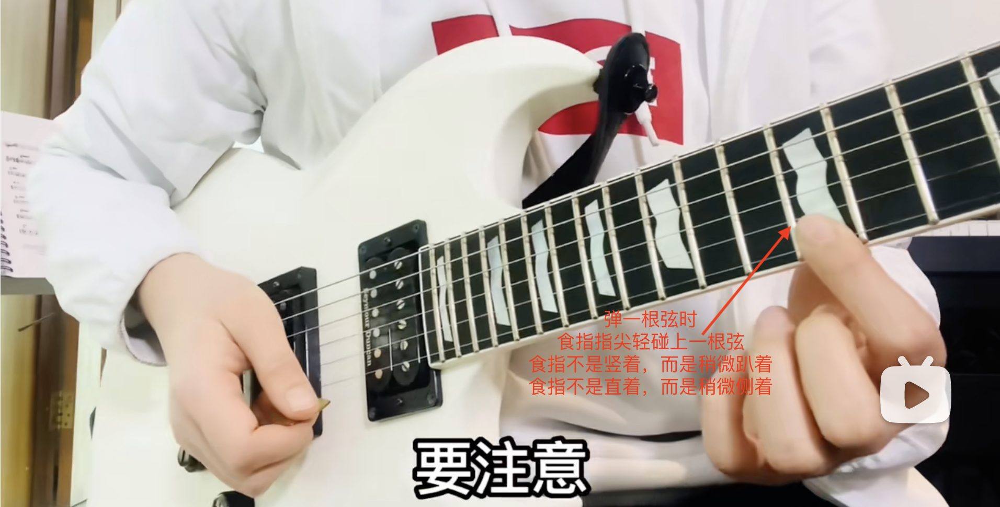
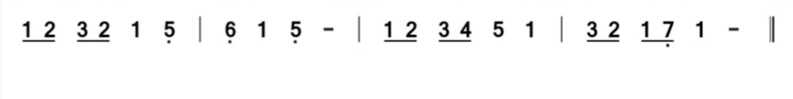

# [电吉他系统教程1.0](https://www.bilibili.com/video/BV1FT411Z7iu/?spm_id_from=333.999.0.0&vd_source=d81aec9513ddc08d0a7b6cf0298b3410)

## Week 0
### 练习类型
+ 手指机能类（1）
+ 音阶和弦类（2）
+ 节奏视唱类（3）
+ 歌曲演奏类（4）
### 练习时间
+ 每周7天
+ 每天2小时（30分钟 * 4）
### 目标
+ 演奏流行歌solo
+ 摆脱六线谱
+ 自己编配指法
+ 演奏funk，blues。。。
### 准备


### 学习建议
+ 先过一遍该周视频并做笔记
+ 每周练习每天都要练习，不要练好一条再练下一条
+ 每条练习都是必要的，尤其是视唱和节奏的练习。

## Week 1
### 目标
+ 找到弹电吉他的感觉
+ 学会如何让大脑和耳朵参与进来
### EX1: 右手空弦下拨（含六线谱介绍）
+ 琴在身体侧面而不是正面
+ 琴头翘起而不是水平于地面
+ 背带的话不要过低
+ 拨片
  - 握紧
  - 露1/4～1/3
+ 护弦
  - 大小鱼际靠在琴弦上 （右手不要悬空）
  - 右手不要太平，要斜一点
  
+ 拨弦
  - 在拾音器中间拨弦
  - 拨片放好之后稍微捏一下拇指，使拨片与琴弦平行，声音好听（但速弹的时候需要倾斜拨片，比如100速度弹16分音符）
  - 发力是手腕，不是大小臂（完全放松）。以手腕为中心，以手为指针，以琴表面为“钟表表面”做钟摆动作，手腕不要“扭动”。
  - 拨弦是下拨，而不是外拨
  - 拨弦手腕用七分力，而不是轻碰琴弦
  - 该练习目的是练习手腕的发力，所以拨弦完成后要“靠弦”（确保方向（向下）和力量（七分力）的正确，否则靠弦不能完成）。
  - 弹六弦时手的角度方向不变，只是“离开”琴面 1cm 左右。手悬空，但小臂和琴有一个接触点
+ 每天练习5分钟
  - 目的是找到舒服放松弹琴的感觉
  - 除了手腕外都不要发力。感受手腕发力的感觉，控制手腕的运动轨迹
  - 不要低头看琴（实在需要看侧头即可）
  - 节拍器40不要加速，速度快的话手腕动作容易变形，锻炼不到对应的肌肉。

### EX2: 12品音高模唱（含音高体系）
+ 12品是空弦的高八度音
+ 目的：
  - 掌握左手按弦方法
  - 记住空弦音
  - 12品附近音域适合人生演唱
 
````
空            12品
E4------------E5
B3------------B4
G3------------G4
D3------------D4
A2------------A3
E2------------E3
````


+ 方法
  - 将左手食指搭在1弦12品，慢慢加力直到琴弦碰到品丝发出正常声音。（感受自己使用了几分力）
  - 往上按弦的时候拇指的位置不要动，手腕有一个转动向前送的动作
  - 左右手护弦



  - 模唱
    + 先弹响一个音，听到音高后唱出来
    + 弹的音不要松开，让弹的和唱的同时发声（比较是否一样）


+ 每天5分钟
  - 左手按弦要非常轻，能正常发声即可
  - 听到振动发声再唱
  - 如果1&6弦太高可以跳过去
  - 要记住1到6弦唱名


### EX3: 1&2指纵向爬格子
+ 弹响下一个音的时候，前一个音才能松开用力


+ 爬格子（换弦）时，拇指的位置不变，但角度时变的（手腕旋转，送/收）


+ 每天5分钟
  - 左手按弦要非常轻，能正常发声即可
  - 不用手指完全放松
  - 唱的时候注意和弹的保持音高一样
  - 节拍器40不要提速
    
### EX4: 1&3指纵向爬格子


+ 每天5分钟
  - 找到独立控制手指的感觉，小指不要紧绷
  - 弹的时候跟着唱，注意音高是否一样
  - 节拍器40不要提速
    
### EX5: 1&2指全指板爬格子
+ 前面的品格比较宽，手指按的部位要尽量靠近品丝
+ 左手拇指在低把位的大概和中指在一个品格，大概在7，8品之后和食指在一个品格。
+ 左右移动品格（比如食指从6弦一品到三品），要按住了直接滑过去、
  
  
  
  
  
+ 每天10分钟
  - 锻炼用触觉找位置（不看指板）
  - 跟着节拍器踩拍子和数拍子
  - 大脑注意弹的音色以及节拍是否正确
  - 节拍器60开始，如果可以连续3分钟不手酸的话（手指机能锻炼手酸才有效），速度加10，直到120.
    
### EX6: 1&3指全指板爬格子


+ 每天10分钟
  - 锻炼用触觉找位置（不看指板）
  - 跟着节拍器踩拍子和数拍子
  - 大脑注意弹的音色以及节拍是否正确
  - 节拍器60开始，如果可以连续3分钟不手酸的话（手指机能锻炼手酸才有效），速度加10，直到120.
    
### EX7: 第5把位C调音阶


+ 食指负责12品，中指13，14品，无名指15品 （也可以食指12， 中指13，无名指14，小指15）


+ 每天10分钟
  - 锻炼用触觉找位置（不看指板）
  - 跟着节拍器踩拍子和数拍子
  - 弹的时候要跟唱
  - 节拍器40开始，如果可以连续3分钟不手酸的话（手指机能锻炼手酸才有效），速度加10，直到120.

  
### EX8: 全&二分&四分音符节奏转换（含音符&拍号）


+ 每天10分钟
  - 锻炼用触觉找位置（不看指板）
  - 跟着节拍器踩拍子和数拍子
  - 弹的时候大脑要思考小节，不要去想音，易于记住音阶图形
  - 节拍器60，不要加速


### EX9: C调简谱视奏（含简谱介绍）
+ 先练习 1，2（最多三个音：1，2，3）。当速度可以达到100时，可以开始3，4（最多6个音：1，2，3，4，5，6）. 当前面4个都弹到原速，可以练习最后一个（全音+不连贯）
+ 对于每条练习，都从原速度的一半开始。

+ 练习9.1


+ 练习9.2


+ 练习9.3


+ 练习9.4


+ 练习9.5


+ 每天10分钟
  - 弹的时候注意力集中，提前看下一个音，想下一个音在纸板上的位置
  - 跟着节拍器踩拍子和数拍子
  - 眼睛要看谱，注意不要背谱。练习的是大脑对于指板音的反应速度，而不是歌曲的演奏流畅度。
  - 弹的时候要跟唱，努力唱准。
  - 节拍器从原速度一般开始，如果连续几次都能弹对，速度+10，直到原速。

### 不再犹豫

## Week 2
+ 手指机能类: 上拨&小指
+ 音阶和弦类：第2把位的部分C调音阶
+ 节奏视唱类：八分音符
+ 歌曲演奏类： 5首歌曲的简谱视奏
### EX1:单弦交替拨弦

+ 每天5分钟
  - 拨弦用七分力
  - 跟着节拍器踩拍子和数拍子
  - 速度从60开始，每分钟加10，弹到120

### EX2:多弦交替拨弦


+ 每天5分钟
  - 不看指板
  - 跟着节拍器踩拍子和数拍子
  - 独立记住每根弦的音名，弹的时候跟唱 （E,B,G,D,A,E）
  - 速度从60开始，每分钟加10，弹到120
    
### EX3: 2&3指全指板爬格子


+ 每天10分钟
  - 不看指板
  - 跟着节拍器踩拍子和数拍子 （八分音符数拍子：1-and, 2-and, 3-and, 4-and. 1-and.....）
  - 手指放松，尤其是拇指
  - 节拍器60开始，如果可以连续3分钟不手酸的话（手指机能锻炼手酸才有效），速度加10，直到100.
  - 每天三组
    
### EX4: 4&1指双弦板爬格子


+ 每天10分钟
  - 练习护弦，往上移动时食指尖顶住上一根弦。往下移动时食指不要完全离开上一根弦。
  - 脚踩拍子
  - 跟唱，注意音高是否相同
  - 眼睛不看手，不用手指完全放松，尤其是拇指
  - 速度从60开始，如果连续3分钟手不酸则+10，指导120.


### EX5: 第2把位C调音阶


+ 每天10分钟
  - 每个音符弹两个八分音符
  - 脚踩拍子
  - 跟唱，注意音高是否相同
  - 眼睛不看手，不用手指完全放松，尤其是拇指
  - 速度从40开始，如果连续3分钟手不酸则+10，指导120.


### EX6: 大小二度模唱（含音程来源）


+ 每天10分钟
  - 脚踩拍子，眼睛不看手
  - 跟唱，注意是大二度还是小二度
  - 速度40，右手下拨，不要加速。模唱训练只有在慢速时候才是有效的

### EX7: 二分&四分&八分音符节奏转换


+ 每天10分钟
  - 脚踩拍子，嘴数拍子，眼睛不看。不要看谱
  - 二分，四分下拨。八分交替拨弦
  - 速度40，不要加速

### EX8: 第2把位简谱视奏

+ 前两个练习没有用到si，所以可以用食指弹do。这样不用小指弹re，用无名指即可。不需要严格按照音阶上下行。从mi到do，食指不能离开琴弦，不然有杂音。


+ 后两个练习是4/3拍





+ 每天30分钟
  - 弹的时候注意力集中，提前看下一个音，想下一个音在纸板上的位置
  - 跟着节拍器踩拍子和数拍子
  - 眼睛要看谱，注意不要背谱。练习的是大脑对于指板音的反应速度，而不是歌曲的演奏流畅度。
  - 弹的时候要跟唱，努力唱准。
  - 节拍器从原速度一半开始，如果连续几次都能弹对，速度+10，直到原速。
    
### 孤独摇滚-打工仔挽歌
### EX9: 青花瓷


+ 每天20分钟
  - 一共16小节，可以分为两句练习
  - 弹之前要练习唱谱
  - 第二把位本来是中指弹do，食指弹si，但本歌曲没有si，则可以用食指弹do。
  - do接mi可以都用食指来弹，可以食指这一下用指腹来弹mi，同时指尖要下滑把do松开，不然会同时发音。
  - 四分音符下拨，八分音符交替拨弦（正拍下，反拍上）。如果正拍是休止符或者延音线，右手要向下空拨
  - 注意“去到我去不了的地方”这一句，无名指弹完la之后要弹re。也要用到无名指折指，用指腹弹re，同时指尖上翘一点儿，把la松开。
  - 节拍器速度40，连续几次没有问题就+10，直到80.

## Week 3
### 单弦16分音符的交替拨弦（含音符时值）
### 三个弦换弦的交替拨弦
### 4&1指全指板板爬格子
### 双弦保留指爬格子
### 第一把位音阶及闷音练习
### 三度搭桥模唱
### 音阶串联及反拍练习（含休止符）
### 1&2把位简谱视奏
### 制音扫弦
### 根音在3弦的C调原位三和弦（含和弦图）
### 孤独摇滚-青春症候群（含滑音&摇滚手型）
### 这世界那么多人

## Week 4
### 单弦含三联音的交替拨弦
### 左手横按的换弦拨弦
### 纵向保留指爬格子
### 4&3指原地交替练习
### 第4把位部分音阶及制音拨弦（含全指板音）
### 相对于do的音程模唱（含整体音程）
### 指板音横向记忆
### 八分音符含休止和延音的节奏视奏（含五线谱介绍）
### 含转调的简谱视奏（含调性&移调）
### 重音移位扫弦
### 根音在5&6弦的五和弦
### 轻音少女-轻飘飘的时间（含闷音扫弦）
### 孤勇者

## Week 5
### 单弦含重音的节奏转换拨弦
### 左手横按的跨线拨弦
### 全指板1234保留指爬格子
### 纵向1434保留指爬格子
### 每弦三音的横向音阶
### 小二度构唱练习
### 半音揉弦练习
### 指板音八度记忆
### 十六分音符少1个音的节奏视奏
### C调五线谱视奏
### 制音移位扫弦
### 根音在5&6弦上的大小三和弦
### 孤独摇滚-双份黑历史
### 晴天

## Week 6 
### 先上拨的单弦节奏转换拨弦
### 先上拨的换弦拨弦（含左手泛音）
### 全指板1434保留指爬格子
### 3指击勾弦练习
### 放克风格扫弦
### 和弦级数及夜空中最亮的星
### 根音在5弦上的3个音的C调七和弦（含波萨诺瓦&混拨）
### 横向音阶串联及反拍下拨练习（含looper的使用）
### 四分之一音揉弦
### 16分音符少2个音的节奏视奏（含附点音符）
### 固定调思维五线谱视奏（含调号）
### 你的名字-梦灯笼
### 好想爱这个世界啊

## Week 7
### 单弦含六连音的节奏转换拨弦（含连音音符）
### 双弦换弦拨弦
### 2&3&4指击勾弦练习
### 2&1指协调性练习
### 三连音少1个音的节奏视奏
### 布鲁斯shuffle节奏
### 全指板横向音阶串联及爵士八分音符
### 大二度构唱练习
### 全音推弦练习
### 指板音纵向记忆
### 根音在六弦的3个音的七和弦及拍弦
### 首调思维五线谱视奏
### 孤独摇滚-你没事吧
### 别看我只是一只羊
